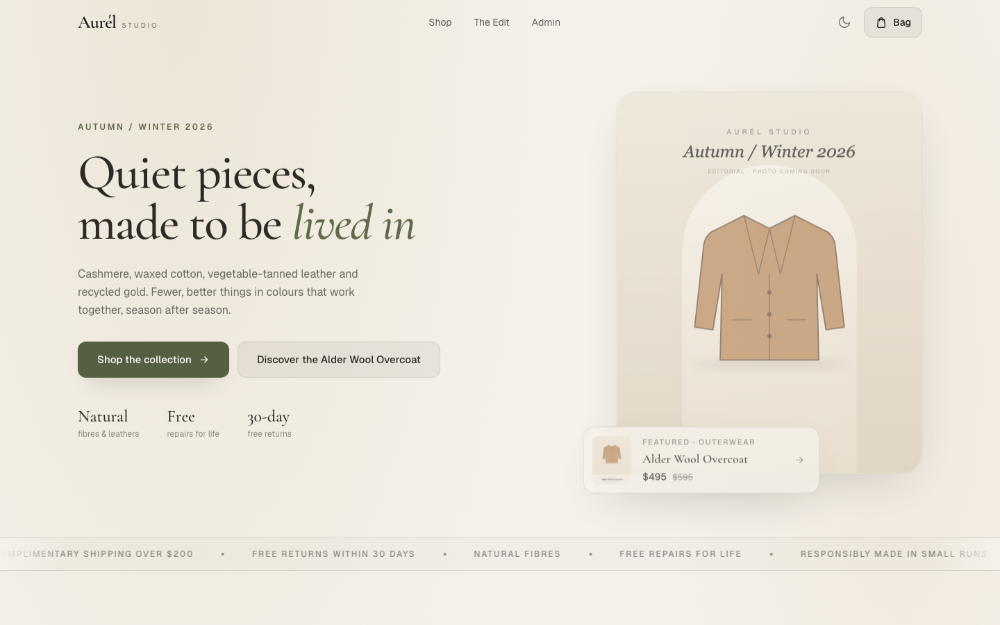
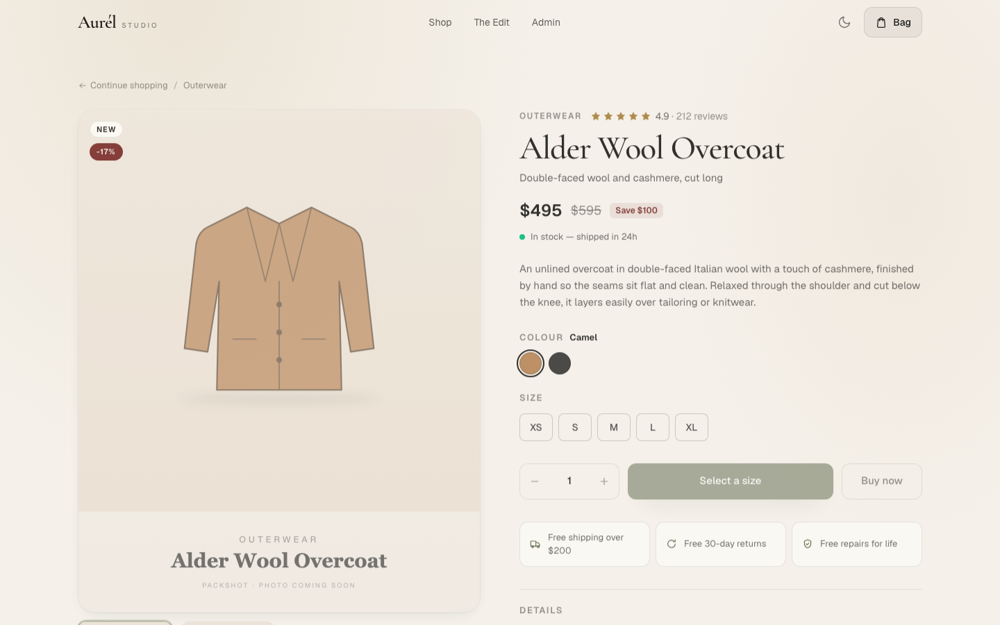

# Aurél Studio

**Live demo:** [divyagopalnadar.github.io/aurel-studio](https://divyagopalnadar.github.io/aurel-studio/) (static version; see [Two data modes](#two-data-modes))

A storefront for a fictional "quiet luxury" clothing and accessories label, built with the Next.js App Router, React 19, TypeScript, Tailwind CSS v4 and Prisma. It covers the usual shop flow: a searchable, filterable catalog; product pages with a gallery, colour and size selection, materials, care and reviews; a persistent cart drawer; and a small admin panel backed by a REST API. The data comes from a real database, most of the UI is server-rendered, and product photography can be dropped in later without touching code. Until then, every image slot shows a generated placeholder in the brand palette.





## Features

- **Catalog.** 18 products in six categories (Outerwear, Knitwear, Shirts & Tops, Bags, Jewelry, Accessories). Search by name, tagline, category or material; filter by category and price band; sort by featured, newest, price or rating.
- **Product pages.** Statically generated per product, with a 4:5 image gallery, named colour swatches, a size picker (hidden for one-size items), details, material and care, reviews, related products and per-page metadata.
- **Cart.** A slide-over drawer driven by React context. Each line is keyed by product, size and colour; quantities are capped at available stock; the cart is saved to `localStorage`.
- **Admin panel** (`/admin`). List, create, edit and delete products (including sizes, colours, material and care) through a modal form. Changes go through the REST API and revalidate the prerendered storefront pages.
- **REST API.** `GET/POST /api/products` and `GET/PATCH/DELETE /api/products/:id`, with input validation and appropriate status codes (400/404/409).
- **Photo-ready imagery.** Photos are picked up automatically when present, with generated placeholders in the meantime. An import script crops and optimises photos, and [`docs/image-prompts.md`](docs/image-prompts.md) has a ready-made prompt for each image.
- **Light and dark themes.** A warm ivory/charcoal palette with a deep olive accent. The theme follows the system preference, remembers the user's choice and is applied before first paint.

## Tech stack

| Area      | Choice                                                            |
| --------- | ----------------------------------------------------------------- |
| Framework | Next.js 16 (App Router, Turbopack), React 19                      |
| Language  | TypeScript (strict)                                               |
| Styling   | Tailwind CSS v4 with CSS-variable design tokens; Geist + Cormorant Garamond via `next/font` |
| Data      | Prisma ORM 6, SQLite for local development                        |
| Images    | `next/image`, `sharp` for the import script                       |
| Tooling   | ESLint (`eslint-config-next`), `tsx` for scripts                  |
| CI        | GitHub Actions: lint, typecheck, production build                 |

## Architecture

- **App Router, server-first.** Pages under `app/` are React Server Components that read the catalog through `lib/data.ts`; there is no client-side fetching for storefront data. The home page and product pages are prerendered at build time. In the database build, `/admin` renders on each request.
- **Client components only where needed.** Interactive pieces (`ShopExplorer`, `ProductCard`, `ProductDetail`, `CartDrawer`, `ThemeToggle`, `AdminPanel`) are marked `"use client"` and receive plain, serialisable `Product` objects.
- **Data layer (`lib/`).** `lib/data.ts` exposes the catalog queries and delegates to one of two `CatalogSource` implementations in `lib/catalog/` (see [Two data modes](#two-data-modes)). The Prisma implementation maps rows to the `Product` type in `data/products.ts`: SQLite has no array columns, so details, sizes, colours (`{ name, hex }`) and image paths are stored as JSON strings and parsed at this boundary. `lib/product-input.ts` validates API payloads.
- **Image resolution (`lib/images.ts`).** The catalog stores canonical photo paths (`/images/products/<slug>-1.jpg`). On the server, `resolveImage()` returns the first file that exists: the `.jpg` photo, then the `.svg` placeholder with the same name, then a generic placeholder. Adding photos therefore needs no database or code changes.
- **API routes.** Route handlers in `app/api/products` (`route.prisma.ts`, database build only) serve the admin panel. After a successful write they call `revalidatePath("/", "layout")`, so prerendered pages pick up the change on their next request.
- **Cart state.** `context/CartContext.tsx` holds lines, totals, drawer state and the "added" toast. It loads from `localStorage` after mount, so server and client markup match during hydration.

## Two data modes

One build-time switch, `NEXT_PUBLIC_DATA_SOURCE` (see `lib/config.ts`), chooses where the catalog comes from. Both modes render the same pages from the same content.

| | `prisma` (default) | `static` (live demo) |
| --- | --- | --- |
| Catalog | SQLite via Prisma (`lib/catalog/prisma.ts`) | The catalog document `data/catalog.json` (`lib/catalog/static.ts`) |
| Output | Next.js server build | Static HTML export (`out/`) served from `/aurel-studio` |
| API routes | `GET/POST/PATCH/DELETE /api/products…` | Not included |
| Admin panel | Writes to the database through the API | Edits a copy of the catalog in the browser (localStorage), with a Reset button |
| Commands | `npm run dev`, `npm run build` | `npm run dev:static`, `npm run build:static` |

How it fits together:

- **One content source.** `data/catalog.json` is the catalog document. The static build reads it directly, and `prisma/seed.ts` seeds SQLite from it, so both modes show identical products.
- **API routes are excluded from the static export with `pageExtensions`.** The handlers are named `route.prisma.ts`. The database build adds `"prisma.ts"` to `pageExtensions`, so Next treats them as route handlers. The static build uses the default extensions, so they are ordinary modules and never become routes. A static export can't contain request-dependent handlers, so this keeps them out without commenting code or moving files around.
- **Server-only features are gated on the switch.** The admin page calls `connection()` (render per request) only in the database build. `lib/data.ts` loads the Prisma implementation with a dynamic import, so the static bundle doesn't include Prisma.
- **Sub-path hosting.** In static mode `next.config.ts` sets `output: "export"`, `basePath: "/aurel-studio"` (override with `PAGES_BASE_PATH`), `trailingSlash` and `images.unoptimized`. `next/link` and framework assets pick up the base path automatically. Catalog image paths get it from `withBasePath()`, because unoptimized `next/image` and plain `` use `src` as given.

## Getting started

Requires Node.js 20.9 or newer.

```bash
npm install
cp .env.example .env        # DATABASE_URL="file:./dev.db"
npm run db:migrate          # create the SQLite database and apply migrations
npm run db:seed             # load the 18-product sample catalog
npm run dev                 # http://localhost:3000
```

Running `npm run db:seed` again resets the catalog. It upserts the products from `data/catalog.json` (replacing their reviews) and removes any product whose slug isn't in the document.

To run the static version instead (no database needed): `npm install`, then `npm run dev:static` and open `/aurel-studio/`.

## Adding product photos

The store looks finished without photos, but it's built for them. Each product has two image slots and the home page has one:

| Slot | File | Content |
| --- | --- | --- |
| Packshot | `public/images/products/<slug>-1.jpg` | The item alone on a studio background |
| Styled / detail | `public/images/products/<slug>-2.jpg` | Close-up, hands or a partial model, no face |
| Hero | `public/images/hero.jpg` | Editorial campaign image |

1. Generate images with the prompts in [`docs/image-prompts.md`](docs/image-prompts.md). The file has one shared style block for consistency and a prompt labelled with each file name.
2. Save them to `incoming-images/` (gitignored) as `<slug>-1.png|jpg|webp`, `<slug>-2.…` and `hero.…`.
3. Run `npm run images:import`. It centre-crops each image to 4:5, resizes it to 1600 × 2000, writes optimised JPEGs (quality 82) into `public/images/`, lists which photos are still missing, and exits non-zero if any file name isn't recognised.

Photos appear immediately in development. Production pages are prerendered, so rebuild after adding photos. `npm run images:placeholders` regenerates the placeholder SVGs from the catalog if you add or rename products.

## Scripts

| Script                       | What it does                                              |
| ---------------------------- | --------------------------------------------------------- |
| `npm run dev`                | Start the development server                              |
| `npm run build`              | Create a production build (database mode)                 |
| `npm run dev:static`         | Development server for the static mode                    |
| `npm run build:static`       | Static export to `out/` for GitHub Pages                  |
| `npm run start`              | Serve the production build                                |
| `npm run lint`               | Run ESLint                                                |
| `npm run typecheck`          | Type-check with `tsc --noEmit`                            |
| `npm run db:generate`        | Generate the Prisma client                                |
| `npm run db:migrate`         | Apply migrations in development (`prisma migrate dev`)    |
| `npm run db:seed`            | Seed the database from `data/catalog.json`                |
| `npm run images:import`      | Import photos from `incoming-images/`                     |
| `npm run images:placeholders`| Regenerate placeholder SVGs from the catalog              |

## Project structure

```
app/
  layout.tsx              Root layout: fonts, theme script, cart provider, header/footer
  page.tsx                Home: hero, marquee, catalog explorer, "The Edit"
  product/[id]/           Product detail page (SSG) and its not-found state
  admin/                  Admin page
  api/products/           REST route handlers, database build only (route.prisma.ts)
components/               UI components; components/ui holds primitives, components/admin the admin panel
context/CartContext.tsx   Cart state and localStorage persistence
data/catalog.json         The catalog document (single source of product content)
data/products.ts          Domain types; exposes the catalog document
lib/config.ts             Data source switch and base path helper
lib/catalog/              CatalogSource interface with Prisma and static implementations
lib/admin-store.ts        Admin persistence: REST API or browser localStorage
lib/                      Also: Prisma client, image resolution, API input validation, utilities
prisma/                   Schema, migrations, seed script
public/images/            Placeholders now, photos later
scripts/                  Photo import and placeholder generator
docs/                     Screenshots and image-generation prompts
.github/workflows/        ci.yml (database build) and pages.yml (static deploy)
```

## Deployment notes

- **GitHub Pages (live demo).** `.github/workflows/pages.yml` runs on every push to `main`: lint, typecheck, `npm run build:static`, then it publishes `out/` with `actions/deploy-pages`. The CI workflow (`ci.yml`) keeps building the database version, so both paths stay green.

- **Full (database) version.** SQLite is for local development only. The database is a file on disk, and serverless platforms such as Vercel have no persistent writable filesystem, so admin writes would not persist there. To deploy, switch the Prisma `datasource` provider to `postgresql` (Neon, Supabase, Vercel Postgres, etc.), set `DATABASE_URL`, regenerate the migrations and run `prisma migrate deploy` before building.
- **The build reads the database.** Home and product pages are prerendered, so `next build` needs a migrated, seeded database. CI uses a throwaway `file:./ci.db`.
- **Images.** Photos are resolved on the server when a page renders, so a deploy includes whatever is in `public/images` at build time.

## Demo limitations

This is a portfolio demo, not a production shop:

- **Static live version.** The GitHub Pages build has no server. Admin edits are saved only in the visitor's browser and don't change the published pages, and products created there have no product page. Photos added later appear after the next deploy.

- **No authentication.** `/admin` and the write API routes (`POST`, `PATCH`, `DELETE` under `/api/products`) are open to anyone who can reach the app. Put them behind authentication (for example Auth.js plus a role check in the route handlers) before exposing this publicly.
- **No checkout or payments.** The cart lives only on the client.
- The brand, products and reviews are fictional.
